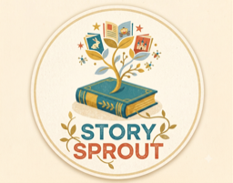

<p align="center">
  
</p>

# 🌱 StorySprout

**Transform any book into a children's picture book.**

Let a 6-year-old experience *The Great Gatsby* — not through a boring, stripped-down summary, but through a genuine picture book that keeps the original soul, characters, and vibe intact.

**Google Cloud Rapid Agent Hackathon** · Track: MongoDB · [Devpost](https://rapid-agent.devpost.com/)

🔗 **Live demo**: https://picture-book-gen-e3mtc46uua-uc.a.run.app

---

## 1. What Inspired Me

When I was a kid, I hated reading long blocks of text and always preferred pictures. Classic literature sounded so boring to me, and history books were just way too long. I wish there were classic storybooks made specifically for young kids — not through a boring, stripped-down summary, but through a genuine picture book that keeps the original soul, characters, and vibe intact.

## 2. Challenges

To do this, we had to solve three big problems:

- **Smart Simplification** — Breaking down a massive novel into distinct scenes without losing the core plot, and translating it into 6-year-old friendly language.
- **Text-to-Image Alignment** — Making sure the illustrations actually match the emotions and details of the story.
- **Character Consistency** — Keeping the main character looking exactly the same across a 40-page book without their face or clothes shifting.

## 3. How I Built It

### 3.1 The 4-Agent Pipeline

I use **Google ADK's `SequentialAgent`** to run four distinct roles back-to-back on Cloud Run:

| Agent | Role |
|-------|------|
| **Analyzer** | Pulls the book in (e.g. from Project Gutenberg), maps out who the main characters are, and uses the TextTiling algorithm to find the story's emotional highs and turning points. |
| **Writer** | Takes those scenes and rewrites them into simple, engaging prose for kids. |
| **Artist** | Uses Gemini 3 Flash Image to create the illustrations and blends the story text naturally into the art (like inside clouds or speech bubbles). |
| **Vision QA** | Powered by Gemini 3.5 Flash (Vision), this agent checks the images against the original character design. If a page doesn't look right, it triggers a self-correction loop to automatically redraw it based on feedback. |

### 3.2 Solving Consistency (MongoDB MCP)

To stop characters from changing appearance, I used the **MongoDB MCP Server**:

- During the setup phase, every character gets a locked-in **"Visual Identity Sheet"** saved in MongoDB as the single source of truth.
- Every time the Artist Agent draws a new page, this reference sheet is read back through MCP, ensuring the protagonist looks identical from page 1 to page 40.

### 3.3 Google Cloud Infrastructure

- **AI Models** — Everything runs on **Vertex AI**: Gemini 3.5 Flash for fast text processing and Vision QA, and Gemini 3 Flash Image for drawing.
- **Compute & Storage** — The backend runs on **Cloud Run**, and all image assets, character data, and final PDFs are stored in **Google Cloud Storage**.

The final result is a beautiful, square-format PDF book, plus an interactive web app where users can click and fine-tune any character, scene, or text overlay on the fly.

## 4. What I Learned

- **Chaining mini-agents is way better than one giant prompt** — it made the whole storytelling pipeline incredibly stable and fast.
- **MCP is a total game-changer for database sync**, allowing me to lock in a single "visual identity source of truth" without writing endless glue code.
- **Closing the loop with automated Vision QA is the future** — it turns unpredictable AI drawings into a reliable, high-quality production line.

---

## Quick Start (local)

```bash
pip install -r requirements.txt
cd frontend && npm install && cd ..

cp .env.example .env
# Default backend is Vertex AI (uses your gcloud ADC + GCP_PROJECT).
# No GCP project? Set GEMINI_BACKEND=api_key and add GEMINI_API_KEY.

python -m uvicorn src.app:app --port 8000          # backend
cd frontend && npm run dev                          # frontend → http://localhost:3000
```

> 📄 Submission materials (Devpost description + video script): see **[SUBMISSION.md](SUBMISSION.md)**

---

## License

This project is **open source** under the **[GNU AGPL-3.0](LICENSE)**.

You are free to use, study, modify, and redistribute it, including running it
as a network service — provided derivative works and hosted modifications are
also published under AGPL-3.0. For commercial licensing outside the AGPL terms,
contact the author.

Built for the **Google Cloud Rapid Agent Hackathon 2026** (MongoDB track) with
Google ADK · Gemini 3 on Vertex AI · MongoDB MCP.
